[Source](https://www.youtube.com/watch?v=GFQaEYEc8_8&t=2s)

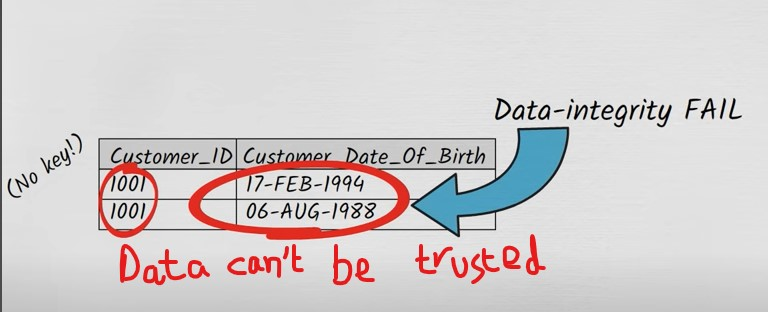

The reason is not that the data is bad. It is more due to bad database design. The database is not normalized.

### What is database normalization?
When you normalize a database table, you structure it in such a way that it can't express redundant information.

### Normalized tables are:
1. Easy to understand
2. Easier to enhance and extend
3. Protected from:
	- Insertion anomalies
	- Update anomalies
	- Deletion anomalies

### The normal forms:
1. First normal form -- 1NF
2. Second normal form -- 2NF
3. Third normal form -- 3NF
4. Fourth normal form -- 4NF
5. Fifth normal form -- 5NF
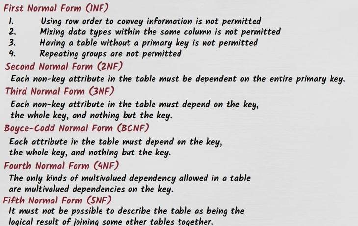

Think of these normal forms by analogy with safety assessment. If a database is of first normal form then we can take it as a safety level 1. Then if it comply with second normal form then it is even more safer. For safety the above list from top to bottom is safe --- very safe.
If database is of first normal form then that is minimum safety gurantee.

### First Normal Form (1NF)
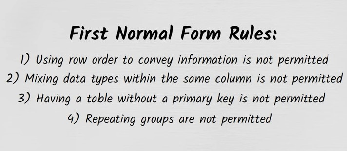
- Using row order to convey information voilates 1NF.
	- Such as if the names in the column are inserted in such a way that they are arranged in a manner that they represent person with shortest height at the top and the person with the tallest height is at the bottom.
	- Solution: Use a separate column for the heights.
- Mixing data types in a single column also voilates the 1NF.
	- Happens in case od spreadsheets as they will not stop you from inserting values of different data types in a single column.
- Desigining a database table without a primary key also voilates 1NF.
- Storing a repeating group of data items on a single row voilates first normal form.
  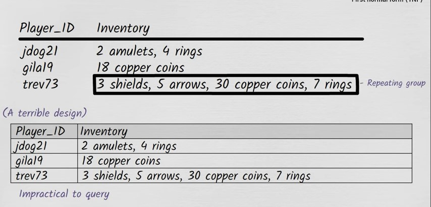
  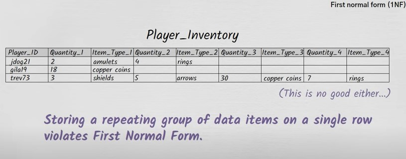
  
  **Solution**
  
  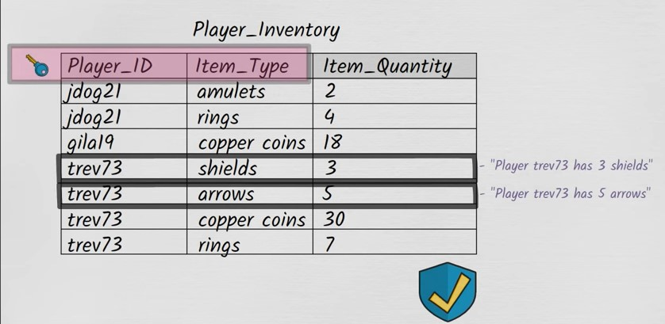
  In this case, both `Player_ID` and `Item_Type` columns collectively are made the primary key. This is composite key.

### Second Normal Form (2NF)
2NF is all about how non-key attributes in the table relate to the primary of the table.
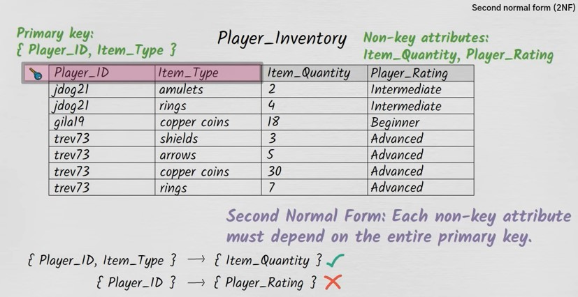

The above table is not in 2nd Normal form. The correct would be:
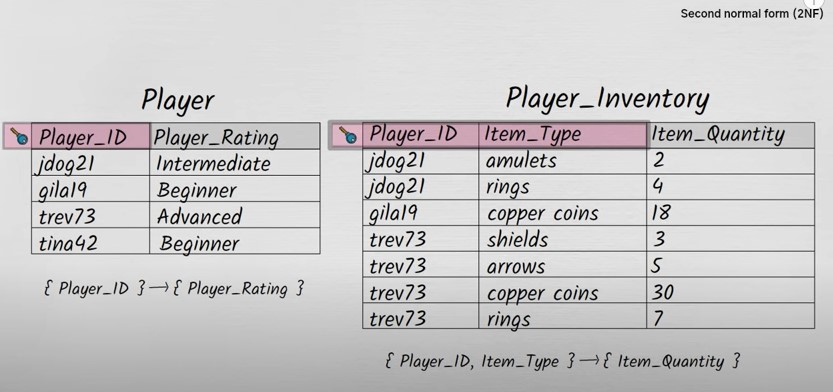

Now our tables are in 2nd Normal form.
- Some common problems which may arise when our table is not in 2nd Normal form.
	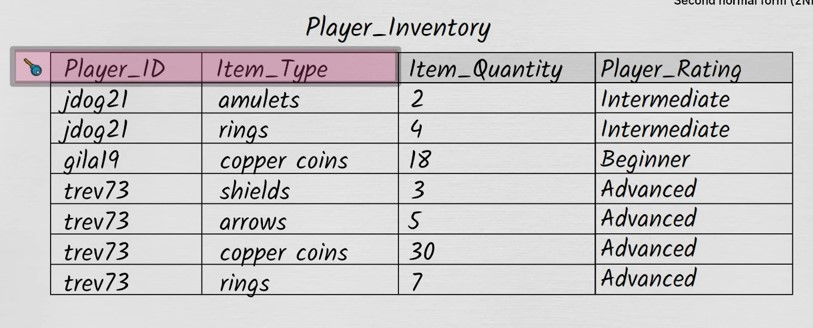
	
	Let's suppose the layer with the `Player_ID` of `gila19` lost all of his copper coins then that row will be deleted and later on if we want find out his `Player_Rating` then we are out of luck. This is called deletion anomaly.
	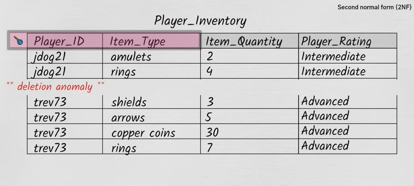
	
	There is another problem here, let's suppose the player with `Player_ID` of `jdog21` improves his rating from from intermediate to advanced then we have to run the update query and it's possible that only one of two records get updated. This is called update anomaly.
	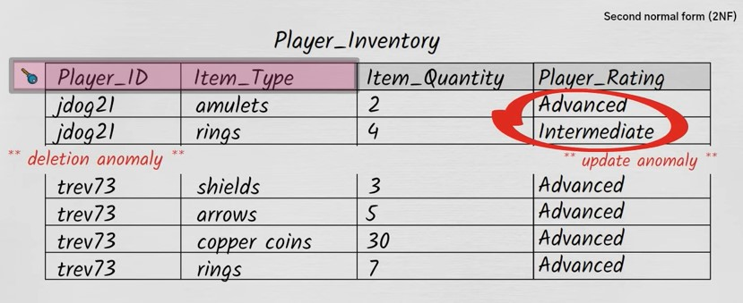
	
	Let's say a new player came but because he has nothing in his inventory so we cannot add him the `Player_Inventory` table. So, his rating will go un-inserted. This is called insertion anomaly.
	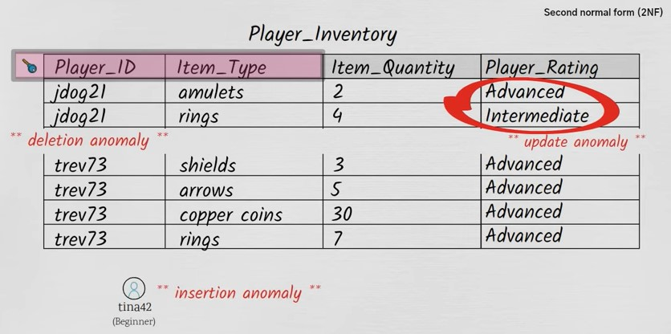

### 3rd Normal Form (3NF)
3rd normal form:
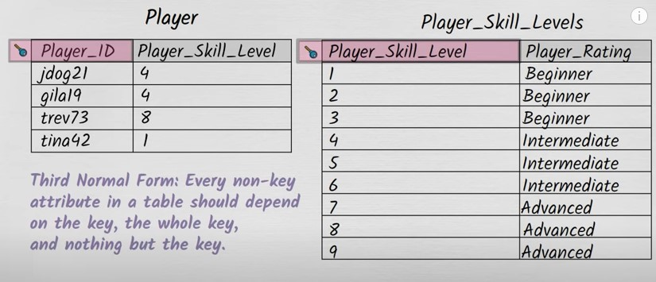

Let's assume this table:
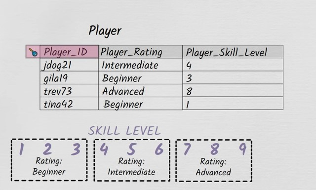

Now, let's assume that `Player_Skill-Level` of player with `Player_ID` of `gila19` increases from 3 to 4 someday and we run update query but somehow that only updated the `Player_Skill_Level` but not `Player_Rating`, then a data consistency issue will arise.
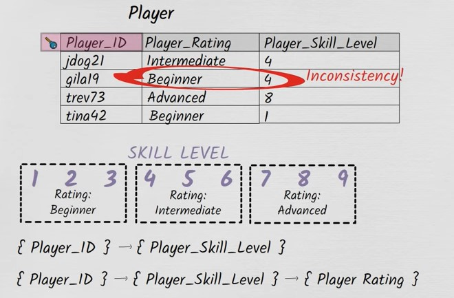

Dependecy of this kind is called **transitive dependency.** Dependency of non-key attribute on another non-key attribute. That's why this table is not in 3rd normal form.
Solution will look like this:

**Boyce-codd Normal-form**

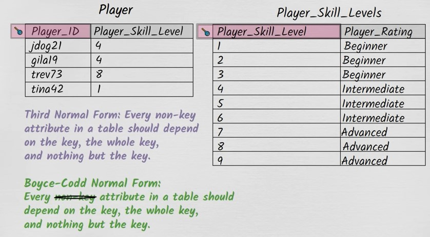

### 4th Normal Form (4NF)
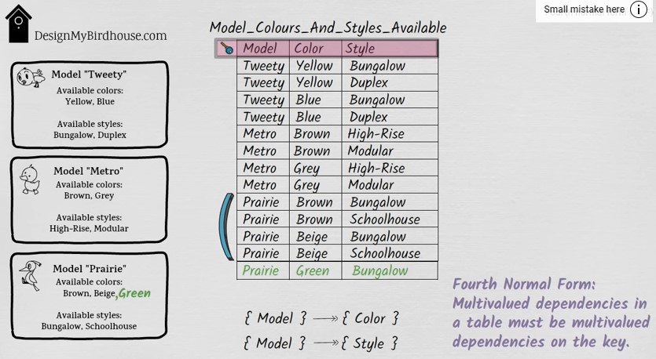

Solution

### 5th Normal form
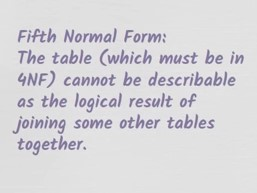

Initially, let's assume that we have this table:
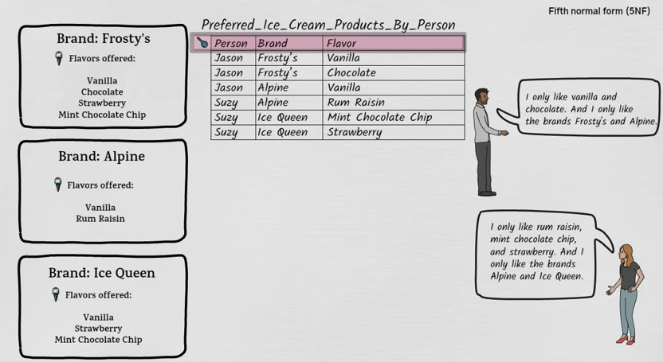

Later `Suzy` announced that she started liking `Frosty's` brand ice cream also so we have to update the table

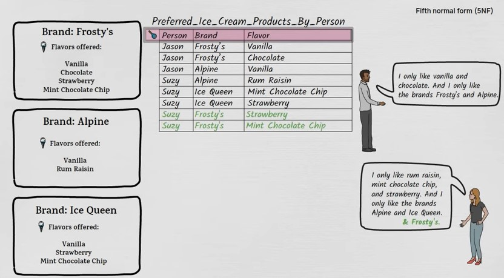

There will be no surprise if we might get this update wrong

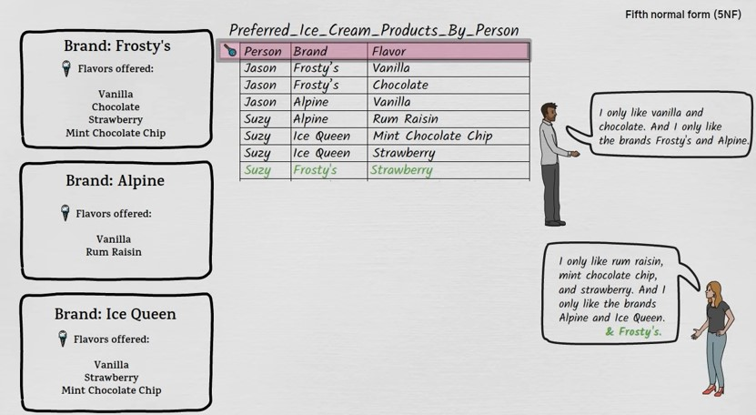

The solution would look like this:

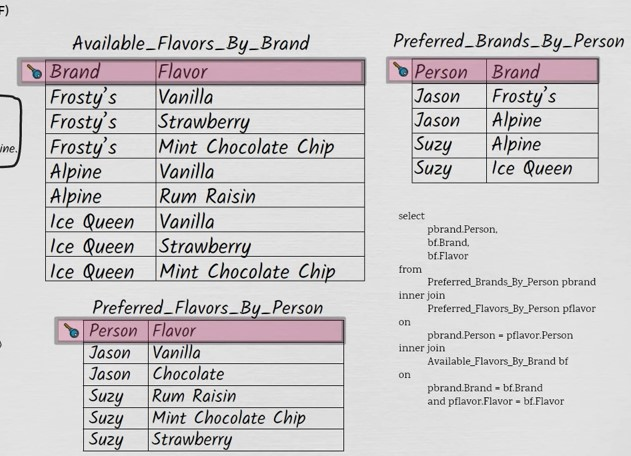

### NOTES
- The more normalized the database is, the less data redundancy (data duplication) you will have and the more data integrity you will have. The more correct the data will be.
